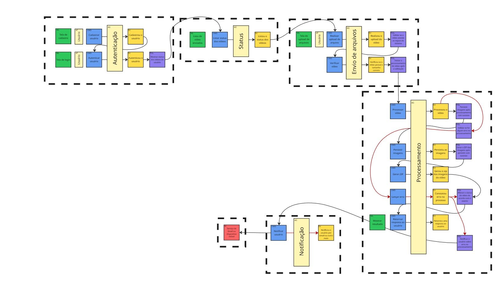
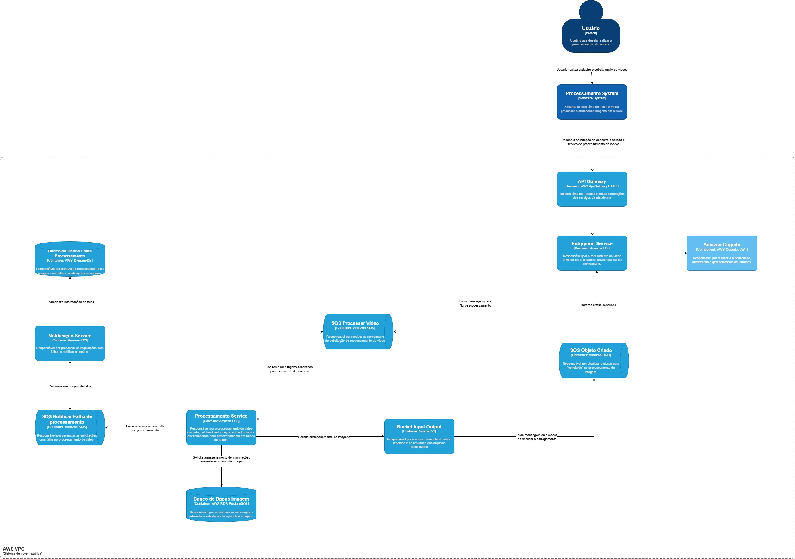

# Hackaton FIAP

---

## Integrantes do grupo:

- Jose Augusto dos Santos- RM 361650
- Nathalia Matielo Rodrigues- RM 363100
- Rogerio Inacio Silva Junior- RM 364104
- Vanessa Moreira Wendling - RM 362741

---


## 📦 Funcionalidades Entregues no Hackaton ##

Sistema de processamento de vídeo  responsávavel por processar e armazenar imagem. O sistema atende os seguintes requisitos:


- DDD Event Storm 
- Desenho de Arquitetura Serviços AWS
- Desenho de solução C4
- Hackaton_video_processor: Responsável por fornecer endpoints para usuário interagir com o sistema via front, autenticação via cognito e upload de arquivo via presignerdUrl e worker do microserviço de processamento.
- ms_envio-arquivos: Responsável por front do projeto
- ms_notificacao: Microserviço responsável por notificar o cliente
- AWS RDS banco responsável por armazenar as informações sobre a solicitação de upload de imagem
- AWS DynamoDB responsável por armazenar as informações sobre as falhas de processamento 
- AWS SQS Processar Imagem responsável por receber solicitações de processamento de vídeo
- AWS SQS Objeto Criado responsável por atualizar status de processamento concluido 
- AWS SQS Notificar Falha responsável por gerenciar solicitações com falha no processamento de vídeo
- AWS S3 bucket responsável por o armazenamento de vídeo recebido e resultado do processamento 
- Cobertura de testes superior a 80% 
- Branches Main/Master protegidas
- Deploy automatizado via CI/CD
---


##  Arquitetura

- Solução

Link para consulta: https://miro.com/app/board/uXjVGLtSdE4=/


- DDD

Para detalhamento de todo processo, acesse: https://miro.com/app/board/uXjVGLtSdE4=/


- C4

Para mais detalhes, acesse: https://app.diagrams.net/#G1xioIxxJi1VVWhvkKYEgaMYCNj68RyCyw#%7B%22pageId%22%3A%22U8mRmWQbRVMD_ljyt-Tk%22%7D


---

## 🎥 Vídeo Demonstrativo

Assista ao vídeo com demonstração do funcionamento da aplicação e da arquitetura: 


---

## ⚙️ Tecnologias Utilizadas

- Go
- Java 17
- Spring Boot
- Kubernetes
- DynamoDb
- RDS
- SQS
- Terraform
- Github Actions

---

## 🚀 Como Executar Localmente

1. Instale JDK 17 e Maven.
2. Clone o repositório:
    ```bash
    git clone https://github.com/SOAT-FIAP-GROUP/SOAT_Pagamentos.git
    cd SOAT_Pagamentos
    ```
3. Crie o banco de dados DynamoDB via terraform

4. Execute a aplicação via Maven:
    ```bash
    mvn spring-boot:run
    ```
5. Acesse a documentação Swagger:
    ```
    http://localhost:8082/swagger-ui/index.html
    ```
## 🚀 Como Executar via Kubernetes
1. Instalar Kubernetes com Minikube, ou
2. Instalar Docker Desktop e ativar Kubernetes
  - Se estiver usando **Minikube** habilite o metrics-server (necessário para HPA funcionar):
    ```bash
    minikube addons enable metrics-server
    ```
  - Aplique os manifetos YAML:
    ```bash
    kubectl apply -f k8s/
    ```
  - **Se estiver usando Minikube:**
    ```bash
    minikube service pagamento-service
    ```

   Esse comando deve abrir automaticamente uma aba no navegador com a URL.  
   Acesse `.../swagger-ui/index.html` no final da URL para ver a documentação dos endpoints.

  - **Se estiver usando Docker Desktop:**

   Acesse diretamente no navegador:

  - http://localhost:30000/
  - http://localhost:30000/swagger-ui/index.html

   Neles você poderá visualizar a documentação interativa (OpenAPI/Swagger) dos endpoints disponíveis.

  - Endpoints para Health Checks:
    - Liveness Probe:
    ```bash
    /actuator/health/liveness
    ```
    - Readiness Probe:
    ```bash
    /actuator/health/readiness
    ```

---

#### 🔍📚 Collection API (Postman)

Para ter acesso aos Endpoints e exemplos faça o download da collection e importe na sua IDE de preferência:
[Collection API](https://drive.google.com/uc?export=download&id=1xp52ZV3tcdlxPq5wG7C6tpEA4O6jXKvB)

---

